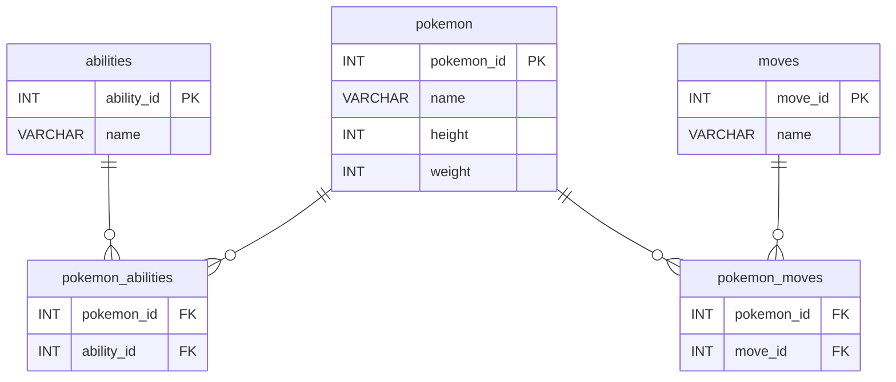

### Projeto

# Pokeapi - CoderHouse
Coleta os dados da API [PokeAPI](https://pokeapi.co/) para tratamento, armazenamento e manipulação.


## Fluxo
1. Conecta na API
2. Através dos endpoints, coleta as informações dos Pokemons, sendo:
   - Pokemon
   - Habilidades
   - Movimentos
3. Armazena em um banco de dados
4. Através de um Notebook Jupyter, faz a analise dos dados


## Pré-reqs
É preciso ter uma banco de dados MySQL para armazenamento dos dados. Criei um 'docker-compose.yml' para subir um MySQL no Docker pra facilitar o trabalho em teste e homologação.

Com o banco funcional, crie o arquivo 'config.py' dentro da pasta 'src/' e adicione o trecho abaixo no arquivo (caso queira trocar os dados de acesso, lembre-se de avaliar o 'docker-compose.yml' também).

```shell
MYSQL_CONFIG = {
    'MYSQLUSER': 'myuser',
    'MYSQLPASSWORD': 'mypassword',
    'MYSQLSERVER': '172.19.0.2',
    'MYSQLDB': 'db_pokeapi',
}
```

## Infraestrutura do Banco de Dados Pokémon


## Endpoints de referência na API
[Pokemons](https://pokeapi.co/api/v2/pokemon/)
